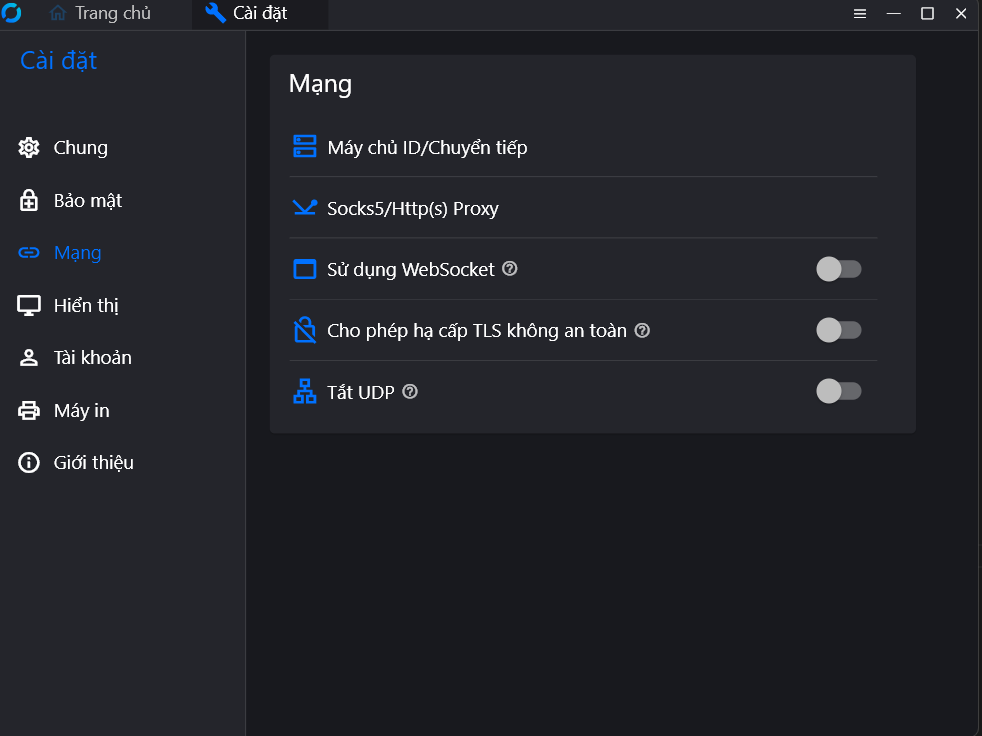

# Hướng dẫn triển khai RustDesk Server

## Yêu cầu
- Windows 11
- Docker Desktop (đã bật WSL2 Integration)
- Quyền Administrator

## Các bước triển khai

### Bước 1: Khởi động server
```powershell
cd D:\rustdesk-server <vị trí thư mục lưu git của bạn>
docker compose up -d
docker compose ps
### Bước 2: Cập nhật proxy
cd D:\rustdesk-server\scripts
.\update-portproxy.ps1
### Bước 3: Lấy public key
xem trong logs của docker desktop ở hbbs có phần key
### Bước 4: Cấu hình client
mở rustdk vào phần setting -> network -> câu hình 
ID Server: <IP_Windows_VMnet8>:21116
Relay Server: <IP_Windows_VMnet8>:21117
Key: <public key ở bước 3>


---

# 5. BUỔI 3 – Cài đặt môi trường build

Phần này dành cho **Bạn 1 (Client Developer)**, phụ trách build và tùy biến RustDesk Client trên Windows.

> **Lưu ý quan trọng:** Các lệnh bên dưới đã được điều chỉnh theo quá trình build thực tế của nhóm. Một số lệnh trong hướng dẫn ban đầu cần thay đổi, đặc biệt là vị trí `vcpkg`, Cargo cache/target và tham số `--features "inline"`.

## 5.1. Chọn hướng build

| Hướng | Công cụ | Kết quả |
| :--- | :--- | :--- |
| A. Linux binary | Docker builder | Binary chạy trên Ubuntu |
| **B. Windows `.exe`** | **Rust + VS Build Tools + Flutter + LLVM + vcpkg** | **RustDesk Client cho Windows** |

Đối với đồ án của nhóm, chọn **Hướng B** vì mục tiêu là phát hành Client cho người dùng Windows.

---

## 5.2. Hướng B – Cài đặt công cụ

### Bước 1: Cài Rust

Cài Rust bằng `rustup` và chọn **default installation**.

Kiểm tra:

```powershell
rustc --version
cargo --version
```

Trong quá trình thực hiện thực tế, môi trường đã sử dụng Rust:

```text
cargo 1.98.1
rustc 1.98.1
```

Kiểm tra vị trí:

```powershell
where.exe cargo
where.exe rustc
```

> **Lưu ý:** `cargo.exe` và `rustc.exe` có thể vẫn nằm trong `C:\Users\<user>\.cargo\bin`. Điều này không có nghĩa Cargo cache phải nằm trên ổ C.

---

### Bước 2: Cài Visual Studio Build Tools 2022

Cài **Build Tools for Visual Studio 2022**.

Trong **Workloads**:

- `Desktop development with C++`

Trong **Individual components**, cần có:

- Windows 10/11 SDK
- C++ CMake tools for Windows
- MSVC C++ build tools

Kiểm tra compiler nếu cần:

```powershell
where.exe cl
```

Trong môi trường đã build thành công, vcpkg sử dụng compiler dạng:

```text
D:/Visual studio/VC/Tools/MSVC/14.51.36231/bin/Hostx64/x64/cl.exe
```

---

### Bước 3: Cài LLVM

RustDesk cần LLVM/Clang cho một số dependency.

Cài LLVM cho Windows 64-bit.

Sau khi cài, kiểm tra:

```powershell
clang --version
```

Nếu build báo lỗi:

```text
libclang not found
```

thì cần xác định thư mục `bin` của LLVM và thiết lập:

```powershell
$env:LIBCLANG_PATH="D:\enviroment\LLVM\bin"
```

Có thể kiểm tra:

```powershell
Test-Path "$env:LIBCLANG_PATH\libclang.dll"
```

Nếu trả về `True` thì đường dẫn `libclang` đã được nhận.

---

### Bước 4: Cài Flutter SDK

Flutter được sử dụng cho phần UI của RustDesk.

Ví dụ:

```text
D:\enviroment\flutter
```

Thêm:

```text
D:\enviroment\flutter\bin
```

vào `PATH`.

Kiểm tra:

```powershell
flutter --version
flutter doctor
```

> **Lưu ý:** Không nhất thiết phải đặt Flutter tại `C:\flutter`. Có thể đặt ở ổ D để giảm sử dụng ổ C.

---

## 5.3. Cài vcpkg – điều chỉnh theo môi trường thực tế

Hướng dẫn ban đầu dùng:

```text
C:\vcpkg
```

Nhưng trong môi trường thực tế của nhóm, vcpkg được đặt tại:

```text
D:\enviroment\vcpkg
```

Kiểm tra:

```powershell
Test-Path "D:\enviroment\vcpkg\vcpkg.exe"
```

Kiểm tra version:

```powershell
D:\enviroment\vcpkg\vcpkg.exe version
```

Thiết lập:

```powershell
$env:VCPKG_ROOT="D:\enviroment\vcpkg"
```

Để lưu lâu dài:

```powershell
[System.Environment]::SetEnvironmentVariable(
    "VCPKG_ROOT",
    "D:\enviroment\vcpkg",
    "User"
)
```

Sau đó **đóng PowerShell và mở lại**.

Kiểm tra:

```powershell
$env:VCPKG_ROOT
```

> **Lỗi đã gặp:** Machine `PATH` đã chứa `D:\enviroment\vcpkg` nhưng PowerShell hiện tại vẫn có thể chưa nhận `vcpkg` trực tiếp. Khi đó có thể gọi bằng đường dẫn đầy đủ:
>
> ```powershell
> D:\enviroment\vcpkg\vcpkg.exe version
> ```
>
> hoặc mở một PowerShell mới.

---

# 6. BUỔI 4 – Build RustDesk Client gốc

## 6.1. Kiểm tra source code

Project thực tế của nhóm:

```text
D:\HKI 2026-2027\Seminar\seminar_rustdk\rustdesk
```

Di chuyển đúng vào thư mục chứa `Cargo.toml`:

```powershell
cd "D:\HKI 2026-2027\Seminar\seminar_rustdk\rustdesk"
```

Kiểm tra:

```powershell
Test-Path ".\Cargo.toml"
```

Kết quả cần là:

```text
True
```

### Lỗi đã gặp: `could not find Cargo.toml`

Nếu chạy:

```powershell
cargo build --release
```

ở:

```text
D:\HKI 2026-2027\Seminar\seminar_rustdk
```

thì Cargo có thể báo:

```text
could not find Cargo.toml
```

**Nguyên nhân:** đang đứng ở thư mục cha của project.

**Khắc phục:**

```powershell
cd "D:\HKI 2026-2027\Seminar\seminar_rustdk\rustdesk"
```

rồi build lại.

---

## 6.2. Kiểm tra Git submodule

RustDesk sử dụng nhiều thành phần nằm trong Git submodule.

Nếu build báo thiếu:

```text
libs/scrap
```

hoặc:

```text
libs/hbb_common/Cargo.toml
```

thì chạy:

```powershell
git submodule update --init --recursive
```

Sau đó kiểm tra:

```powershell
Test-Path ".\libs\hbb_common\Cargo.toml"
```

Kết quả cần là:

```text
True
```

Có thể kiểm tra trạng thái:

```powershell
git status
git submodule status
```

---

# 6.3. Cài dependencies bằng vcpkg

### Không dùng lại lệnh cũ một cách máy móc

Hướng dẫn ban đầu có:

```powershell
vcpkg install libvpx:x64-windows-static libyuv:x64-windows-static opus:x64-windows-static aom:x64-windows-static
```

Nhưng RustDesk hiện có `vcpkg.json`, tức project đang sử dụng **vcpkg Manifest Mode**.

Vì vậy nếu gặp lỗi kiểu:

```text
manifest mode
```

thì không cần chỉ định danh sách package như trên.

Thực hiện trong thư mục RustDesk:

```powershell
cd "D:\HKI 2026-2027\Seminar\seminar_rustdk\rustdesk"
vcpkg install
```

vcpkg sẽ đọc:

```text
vcpkg.json
```

và cài các dependency mà project yêu cầu.

Trong quá trình thực tế, các package quan trọng đã xuất hiện gồm:

```text
aom
libjpeg-turbo
libvpx
libyuv
mfx-dispatch
opus
```

---

# 6.4. Cài đặt vcpkg binary cache trên ổ D

Trong quá trình build, vcpkg có thể tạo binary cache lớn tại:

```text
C:\Users\<user>\AppData\Local\vcpkg\archives
```

Điều này có thể làm đầy ổ C.

Đã xử lý bằng cách tạo:

```powershell
New-Item -ItemType Directory -Force "D:\vcpkg-cache"
```

Thiết lập cho phiên PowerShell hiện tại:

```powershell
$env:VCPKG_DEFAULT_BINARY_CACHE="D:\vcpkg-cache"
```

Lưu lâu dài:

```powershell
[System.Environment]::SetEnvironmentVariable(
    "VCPKG_DEFAULT_BINARY_CACHE",
    "D:\vcpkg-cache",
    "User"
)
```

Kiểm tra:

```powershell
$env:VCPKG_DEFAULT_BINARY_CACHE
```

> Nếu ổ C đã đầy do cache cũ, có thể kiểm tra:
>
> ```text
> C:\Users\<user>\AppData\Local\vcpkg
> ```
>
> Không xóa nhầm các thành phần cần thiết khác. Trong quá trình thực tế, thư mục `archives` là phần cache binary đã được dọn để giải phóng dung lượng.

---

# 6.5. Chuyển Cargo Target sang ổ D

Build RustDesk tạo rất nhiều file trung gian. Nếu Cargo target vẫn nằm trên ổ C, build có thể gặp:

```text
There is not enough space on the disk. (os error 112)
```

Đã xử lý bằng:

```powershell
New-Item -ItemType Directory -Force "D:\cargo-target"
```

Thiết lập:

```powershell
$env:CARGO_TARGET_DIR="D:\cargo-target"
```

Lưu lâu dài:

```powershell
[System.Environment]::SetEnvironmentVariable(
    "CARGO_TARGET_DIR",
    "D:\cargo-target",
    "User"
)
```

Kiểm tra:

```powershell
$env:CARGO_TARGET_DIR
```

---

# 6.6. Chuyển Cargo Home sang ổ D

Không chỉ `target`, Cargo còn tải source crate và Git dependency vào Cargo Home.

Mặc định có thể nằm tại:

```text
C:\Users\<user>\.cargo
```

Trong quá trình build thực tế, registry đã từng chiếm dung lượng tại:

```text
C:\Users\<user>\.cargo\registry
```

và phát sinh lỗi thiếu dung lượng khi unpack crate `windows`.

Để tránh lặp lại lỗi này:

```powershell
New-Item -ItemType Directory -Force "D:\cargo-home"
```

Thiết lập:

```powershell
$env:CARGO_HOME="D:\cargo-home"
```

Lưu lâu dài:

```powershell
[System.Environment]::SetEnvironmentVariable(
    "CARGO_HOME",
    "D:\cargo-home",
    "User"
)
```

Có thể đặt đồng thời các biến trong PowerShell hiện tại:

```powershell
$env:CARGO_HOME="D:\cargo-home"
$env:CARGO_TARGET_DIR="D:\cargo-target"
$env:VCPKG_DEFAULT_BINARY_CACHE="D:\vcpkg-cache"
```

Sau khi mở PowerShell mới, kiểm tra:

```powershell
$env:CARGO_HOME
$env:CARGO_TARGET_DIR
$env:VCPKG_DEFAULT_BINARY_CACHE
```

> **Lưu ý:** `cargo.exe` có thể vẫn nằm ở:
>
> ```text
> C:\Users\<user>\.cargo\bin
> ```
>
> nhưng dữ liệu Cargo có thể được chuyển sang `D:\cargo-home`. Không cần xóa `.cargo\bin` hoặc `.rustup\toolchains` chỉ để giải phóng cache.

---

# 6.7. Thiết lập RUSTFLAGS

Trong quá trình build, sử dụng:

```powershell
$env:RUSTFLAGS="-C link-arg=/STACK:8000000"
```

Ý nghĩa:

- `RUSTFLAGS`: biến môi trường truyền thêm option cho Rust compiler.
- `-C link-arg=...`: truyền argument trực tiếp cho linker.
- `/STACK:8000000`: thiết lập stack size cho executable/linker.

Nếu muốn áp dụng tự động cho các phiên sau:

```powershell
[System.Environment]::SetEnvironmentVariable(
    "RUSTFLAGS",
    "-C link-arg=/STACK:8000000",
    "User"
)
```

---

# 6.8. Kiểm tra toàn bộ environment trước khi build

Có thể chạy:

```powershell
rustc --version
cargo --version

$env:VCPKG_ROOT
$env:LIBCLANG_PATH
$env:CARGO_HOME
$env:CARGO_TARGET_DIR
$env:VCPKG_DEFAULT_BINARY_CACHE
$env:RUSTFLAGS

Test-Path ".\Cargo.toml"
Test-Path ".\libs\hbb_common\Cargo.toml"
```

Mục tiêu là đảm bảo:

```text
Cargo.toml                         -> True
libs\hbb_common\Cargo.toml        -> True
VCPKG_ROOT                        -> D:\enviroment\vcpkg
CARGO_HOME                        -> D:\cargo-home
CARGO_TARGET_DIR                  -> D:\cargo-target
VCPKG_DEFAULT_BINARY_CACHE        -> D:\vcpkg-cache
```

---

# 6.9. Build RustDesk Client

Trước khi build:

```powershell
cd "D:\HKI 2026-2027\Seminar\seminar_rustdk\rustdesk"
```

Có thể clean target:

```powershell
cargo clean
```

Sau đó build:

```powershell
cargo build --release
```

## Quan trọng: Không dùng `--features "inline"` nếu source hiện tại không có feature này

Hướng dẫn ban đầu:

```powershell
cargo build --release --features "inline"
```

đã gặp lỗi liên quan đến module/feature `inline`.

Trong quá trình build thực tế, lệnh thành công là:

```powershell
cargo build --release
```

Vì vậy **ưu tiên build không có `--features "inline"`** với source hiện tại của nhóm.

---

# 6.10. Các lỗi chính đã gặp và cách khắc phục

## Lỗi 1 – `LNK1108 cannot write file`

Biểu hiện:

```text
LNK1108 cannot write file
```

Nguyên nhân thường liên quan đến:

- ổ đĩa thiếu dung lượng;
- file tạm/TEMP;
- antivirus hoặc process đang khóa file;
- linker không ghi được output.

Cách xử lý trong quá trình thực tế:

1. Kiểm tra dung lượng ổ C và D.
2. Chuyển Cargo target sang D.
3. Chuyển Cargo Home sang D.
4. Chuyển vcpkg binary cache sang D.
5. Kiểm tra process/file đang khóa nếu lỗi vẫn xảy ra.

---

## Lỗi 2 – `libclang not found`

Biểu hiện:

```text
libclang not found
```

Khắc phục:

```powershell
$env:LIBCLANG_PATH="D:\enviroment\LLVM\bin"
```

Kiểm tra:

```powershell
Test-Path "$env:LIBCLANG_PATH\libclang.dll"
```

Nếu cần, kiểm tra:

```powershell
clang --version
```

---

## Lỗi 3 – thiếu `vpx/vp8.h` hoặc `opus/opus_multistream.h`

Biểu hiện:

```text
vpx/vp8.h
opus/opus_multistream.h
```

Khắc phục bằng vcpkg Manifest Mode:

```powershell
cd "D:\HKI 2026-2027\Seminar\seminar_rustdk\rustdesk"
vcpkg install
```

Các dependency liên quan gồm:

```text
libvpx
libyuv
opus
```

---

## Lỗi 4 – thiếu `aom/aom.h`

Biểu hiện:

```text
aom/aom.h
```

Khắc phục:

```powershell
vcpkg install
```

để vcpkg đọc `vcpkg.json` và cài `aom`.

---

## Lỗi 5 – feature/module `inline` không tồn tại

Lệnh ban đầu:

```powershell
cargo build --release --features "inline"
```

gây lỗi liên quan đến `inline`.

Khắc phục:

```powershell
cargo build --release
```

Đây là thay đổi quan trọng so với hướng dẫn build ban đầu.

---

# 6.11. Kết quả build

Sau khi build thành công:

```powershell
ls "$env:CARGO_TARGET_DIR\release"
```

hoặc nếu không sử dụng `CARGO_TARGET_DIR`:

```powershell
ls ".\target\release"
```

Kết quả cần có:

```text
rustdesk.exe
```

Trong lần build thành công của nhóm, RustDesk Client đã được build ở **Release profile** và tạo ra executable `rustdesk.exe`, cùng các file phụ thuộc cần thiết.

Có thể kiểm tra:

```powershell
.\target\release\rustdesk.exe --version
```

Nếu dùng `CARGO_TARGET_DIR=D:\cargo-target`:

```powershell
D:\cargo-target\release\rustdesk.exe --version
```

---

# 6.12. Tóm tắt môi trường build thực tế

| Thành phần | Vị trí / cấu hình thực tế |
| :--- | :--- |
| Rust | `rustup` + Rust MSVC |
| Visual Studio | VS Build Tools 2022 |
| LLVM | `D:\enviroment\LLVM` |
| Flutter | `D:\enviroment\flutter` |
| vcpkg | `D:\enviroment\vcpkg` |
| VCPKG binary cache | `D:\vcpkg-cache` |
| Cargo Home | `D:\cargo-home` |
| Cargo Target | `D:\cargo-target` |
| RustDesk source | `D:\HKI 2026-2027\Seminar\seminar_rustdk\rustdesk` |
| Build command | `cargo build --release` |

---

# 7. QUY TRÌNH BUILD CHUẨN SAU KHI ĐÃ CẤU HÌNH

Sau khi đã cài đặt một lần, các lần build sau có thể thực hiện theo quy trình:

```powershell
cd "D:\HKI 2026-2027\Seminar\seminar_rustdk\rustdesk"

$env:CARGO_HOME="D:\cargo-home"
$env:CARGO_TARGET_DIR="D:\cargo-target"
$env:VCPKG_ROOT="D:\enviroment\vcpkg"
$env:VCPKG_DEFAULT_BINARY_CACHE="D:\vcpkg-cache"
$env:LIBCLANG_PATH="D:\enviroment\LLVM\bin"
$env:RUSTFLAGS="-C link-arg=/STACK:8000000"

git submodule update --init --recursive

vcpkg install

cargo build --release
```

Sau khi thành công:

```powershell
D:\cargo-target\release\rustdesk.exe --version
```

---

# 8. SAU KHI BUILD – CHUYỂN SANG TÙY BIẾN CLIENT

Build thành công `rustdesk.exe` **chưa phải là hoàn thành đồ án**.

Đây mới là nền tảng để **Bạn 1 (Client Developer)** bắt đầu tùy biến RustDesk.

Các bước tiếp theo:

1. Xác định vị trí UI Flutter.
2. Xác định màn hình chính và màn hình Settings.
3. Việt hóa các text cần thiết.
4. Tùy biến logo, icon và branding của nhóm.
5. Ẩn hoặc loại bỏ những chức năng không nằm trong phạm vi đồ án.
6. Giữ lại và cấu hình chức năng kết nối tới server RustDesk riêng của nhóm.
7. Build lại Client sau mỗi nhóm thay đổi.
8. Test kết nối Client ↔ `hbbs`/`hbbr`.
9. Đóng gói bản `.exe` để demo.

**Nguyên tắc:** Không nên viết lại toàn bộ AnyDesk từ đầu. Mục tiêu của đề tài là **tùy biến RustDesk thành Client remote access của nhóm**, sử dụng nền tảng remote access có sẵn của RustDesk và phát triển UI/chức năng theo yêu cầu đồ án.

---

# 9. CHECKLIST BUỔI 3 + BUỔI 4

- [ ] Rust/Rustup hoạt động
- [ ] Visual Studio Build Tools 2022 + C++ workload
- [ ] Windows SDK
- [ ] CMake tools
- [ ] LLVM/Clang
- [ ] Flutter SDK
- [ ] vcpkg
- [ ] `VCPKG_ROOT` trỏ đúng `D:\enviroment\vcpkg`
- [ ] Git submodule đầy đủ
- [ ] `vcpkg.json` tồn tại
- [ ] `vcpkg install` chạy thành công
- [ ] vcpkg binary cache chuyển sang D
- [ ] Cargo Home chuyển sang D
- [ ] Cargo Target chuyển sang D
- [ ] `LIBCLANG_PATH` đúng
- [ ] `RUSTFLAGS` đúng
- [ ] Không dùng `--features "inline"` nếu source hiện tại không hỗ trợ
- [ ] `cargo build --release` thành công
- [ ] Có `rustdesk.exe`
- [ ] Chạy thử `rustdesk.exe --version`
- [ ] Chuẩn bị bước Việt hóa UI
- [ ] Chuẩn bị bước branding/customization
- [ ] Chuẩn bị test Client với server riêng

---

# 10. GHI CHÚ QUAN TRỌNG VỀ Ổ ĐĨA

RustDesk là project lớn và build native có thể tạo nhiều dữ liệu.

Nếu máy có ổ C dung lượng thấp, **không nên chỉ chuyển riêng project source sang ổ D**. Cần chú ý cả:

```text
Cargo Home
Cargo Target
Cargo Registry
Cargo Git dependencies
vcpkg binary cache
TEMP/TMP
```

Trong quá trình thực tế, việc chuyển:

```text
C:\Users\<user>\.cargo
```

sang:

```text
D:\cargo-home
```

và:

```text
target
```

sang:

```text
D:\cargo-target
```

giúp giảm đáng kể nguy cơ lỗi:

```text
There is not enough space on the disk. (os error 112)
```

Đây là một trong những vấn đề quan trọng nhất cần kiểm tra trước khi build lại RustDesk trên máy có ổ C hạn chế dung lượng.

