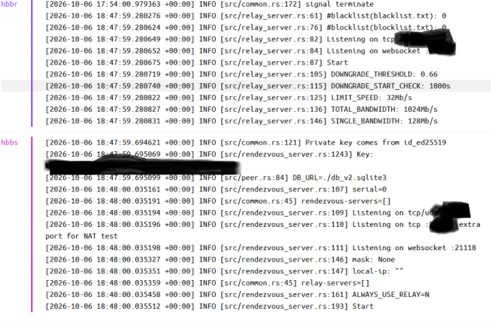

# RustDesk Việt Hóa & Triển Khai Server Riêng

> **Đồ án Seminar – Tuần 1**  
> Nhiệm vụ: Tải mã nguồn, tìm hiểu cấu trúc RustDesk và triển khai RustDesk Server trên Docker Desktop.

---

## 📌 Tổng quan

Trong tuần 1, nhóm tập trung vào việc tiếp cận mã nguồn **RustDesk**, tìm hiểu cấu trúc dự án, xác định các thành phần công nghệ chính và bước đầu triển khai hệ thống RustDesk Server bằng Docker Desktop.

### 🎯 Mốc bàn giao tuần 1

> **Kết nối thành công 2 máy thông qua RustDesk Server riêng.**

Kết quả cuối tuần: **Đã kết nối 2 máy thành công.** ✅

---

## 1. 📥 Tải mã nguồn RustDesk

Mã nguồn được lấy trực tiếp từ repository chính thức của RustDesk:

```bash
git clone https://github.com/rustdesk/rustdesk.git
```

Sau khi clone, nhóm tiến hành khảo sát cấu trúc source code để xác định vị trí của giao diện người dùng, tài nguyên ngôn ngữ và các thành phần phục vụ build.

---

## 2. 🏗️ Thành phần & công nghệ

| Thành phần | Công nghệ |
|---|---|
| Ngôn ngữ chính | **Rust** |
| Giao diện cũ | **Rust + Sciter** |
| Giao diện mới | **Flutter / Dart** |
| Build system cho Rust | **Cargo** |
| Build system cho UI mới | **Flutter SDK** |

### 📂 Các thư mục quan trọng

#### Giao diện người dùng

- `src/ui/` — giao diện cũ, sử dụng **Sciter**
- `flutter/lib/` — giao diện mới, sử dụng **Flutter**

#### Tài nguyên ngôn ngữ

```text
src/lang/
```

Đây là vị trí tài nguyên ngôn ngữ/bản dịch của giao diện cũ.

#### Build trên Windows

Hướng dẫn build trên Windows được tham khảo trong:

```text
Readme.md
```

của repository RustDesk.

---

## 3. 🎨 Các chức năng dự kiến tùy biến

Dựa trên định hướng của đồ án Seminar, nhóm dự kiến tùy biến một số thành phần của RustDesk:

| STT | Chức năng dự kiến tùy biến | Mục đích |
|---:|---|---|
| 1 | 🇻🇳 Giao diện tiếng Việt hoàn chỉnh tương tự AnyDesk | Phục vụ người dùng Việt |
| 2 | 🖥️ Màn hình cấu hình server riêng mặc định | Phục vụ việc triển khai server riêng |
| 3 | 🏷️ Logo và tên thương hiệu riêng | Phù hợp với đồ án Seminar |
| 4 | 🔐 Tích hợp VPN bảo mật | Tăng cường bảo mật kết nối |
| 5 | 🧹 Ẩn các tính năng không sử dụng | Đơn giản hóa giao diện cho doanh nghiệp |

> **Lưu ý:** Đây là các chức năng **dự kiến tùy biến**, chưa phải toàn bộ các chức năng đã hoàn thành trong tuần 1.

---

## 4. 🐳 Triển khai RustDesk Server

Trong quá trình triển khai, nhóm đã thành công chạy được hai container quan trọng của RustDesk Server:

```text
hbbs
hbbr
```

### Vai trò

- **hbbs** — RustDesk ID / rendezvous server.
- **hbbr** — RustDesk relay server.

Việc triển khai được thực hiện trên **Docker Desktop**.

---

## 5. ⚠️ Khó khăn gặp phải

### Mô hình mạng ban đầu

Trong quá trình thử nghiệm, nhóm gặp vấn đề khi cho máy ảo VMware kết nối đến RustDesk Server đang chạy trong WSL2 thông qua Docker Desktop.

Mô hình mạng phát sinh nhiều lớp NAT:

```text
VMware VM
   │
   │ VMware NAT
   ▼
Windows Host
   │
   │ WSL2 NAT
   ▼
WSL2
   │
   │ Docker NAT
   ▼
Docker Container
   │
   ├── hbbs
   └── hbbr
```

Cụ thể:

```text
VMware VM: 192.168.106.x
        ↓
Windows Host
        ↓
WSL2: 172.x.x.x
        ↓
Docker Container
```

### Nguyên nhân

Docker Desktop không tự động mở các port của container để các máy trong mạng/LAN hoặc máy ảo VMware có thể truy cập trực tiếp theo mô hình triển khai trên.

Do đó:

> **VMware VM không thể trực tiếp kết nối đến RustDesk Server đang chạy trong WSL2/Docker.**

---

## 6. 🔧 Cách khắc phục

Nhóm đã thực hiện cấu hình lại `compose.yml`, đồng thời mở các port cần thiết trên Windows Firewall.

### 6.1. Mở port Windows Firewall

Đối với **hbbs**:

```powershell
New-NetFirewallRule -DisplayName "RustDesk hbbs" `
-Direction Inbound `
-Protocol TCP `
-LocalPort <các port> `
-Action Allow
```

Đối với **hbbr**:

```powershell
New-NetFirewallRule -DisplayName "RustDesk hbbr" `
-Direction Inbound `
-Protocol TCP `
-LocalPort <các port> `
-Action Allow
```

Việc cấu hình Firewall cho phép VMware VM và các máy trong LAN truy cập vào các port cần thiết của RustDesk Server.

---

### 6.2. Thiết lập Port Proxy

Nhóm sử dụng `netsh interface portproxy` để chuyển tiếp port từ Windows Host đến địa chỉ IP của WSL2:

```powershell
netsh interface portproxy add v4tov4 `
listenport=<port> `
listenaddress=0.0.0.0 `
connectport=<port> `
connectaddress=<WSL_IP>
```

Mô hình sau khi cấu hình:

```text
VMware VM / LAN
       │
       ▼
Windows Host
       │
       │ Port Proxy
       ▼
WSL2
       │
       ▼
Docker
       │
       ├── hbbs
       └── hbbr
```

---

## 7. ✅ Kết quả tuần 1

### Checklist

- [x] Clone mã nguồn RustDesk
- [x] Tìm hiểu ngôn ngữ và công nghệ sử dụng
- [x] Tìm hiểu cấu trúc giao diện RustDesk
- [x] Xác định vị trí tài nguyên ngôn ngữ
- [x] Tìm hiểu hướng dẫn build trên Windows
- [x] Xác định các chức năng dự kiến tùy biến
- [x] Triển khai container `hbbs`
- [x] Triển khai container `hbbr`
- [x] Xử lý vấn đề kết nối giữa VMware → WSL2 → Docker
- [x] Cấu hình Windows Firewall
- [x] Cấu hình `netsh portproxy`
- [x] **Kết nối thành công 2 máy**

### 🟢 Trạng thái

**HOÀN THÀNH MỐC TUẦN 1**

> RustDesk Server đã được triển khai và hai máy đã kết nối thành công thông qua hệ thống server được cấu hình riêng.

---

## 8. 📊 Tiến độ

```text
Tải mã nguồn                 ████████████████████  100%
Tìm hiểu cấu trúc RustDesk   ████████████████████  100%
Triển khai hbbs              ████████████████████  100%
Triển khai hbbr              ████████████████████  100%
Xử lý kết nối mạng           ████████████████████  100%
Kết nối 2 máy                ████████████████████  100%
```

---

## 9. 🚀 Định hướng tiếp theo

Sau khi hoàn thành mốc kết nối 2 máy, nhóm có thể tiếp tục triển khai các nội dung theo phạm vi đồ án:

- Việt hóa giao diện RustDesk.
- Tùy biến logo và tên thương hiệu.
- Hoàn thiện màn hình cấu hình server riêng.
- Tiếp tục nghiên cứu cơ chế kết nối và relay của RustDesk.
- Nghiên cứu phương án bảo mật/VPN.
- Xác định và ẩn các tính năng không cần thiết.
- Tiếp tục kiểm thử hệ thống trong các mô hình mạng khác nhau.

---

## 👥 Thông tin dự án

**Tên đề tài:** Việt hóa và xây dựng công cụ Remote Access như AnyDesk từ RustDesk

**Môn học:** Seminar chuyên đề

**Nền tảng:** RustDesk

**Ngôn ngữ chính:** Rust

**UI:** Flutter / Dart, Sciter

**Server:** RustDesk `hbbs` / `hbbr`

**Container:** Docker

---

## 📝 Nhật ký tuần 1

| Hạng mục | Trạng thái |
|---|---|
| Khảo sát source code | ✅ Hoàn thành |
| Khảo sát công nghệ | ✅ Hoàn thành |
| Khảo sát UI | ✅ Hoàn thành |
| Docker `hbbs` | ✅ Hoàn thành |
| Docker `hbbr` | ✅ Hoàn thành |
| Xử lý NAT | ✅ Hoàn thành |
| Firewall | ✅ Hoàn thành |
| Port Proxy | ✅ Hoàn thành |
| Kết nối 2 máy | ✅ Thành công |

---

> **Cập nhật:** Tuần 1  
> **Trạng thái:** 🟢 Hoàn thành  
> **Mục tiêu quan trọng:** Kết nối thành công 2 máy qua RustDesk Server riêng.
